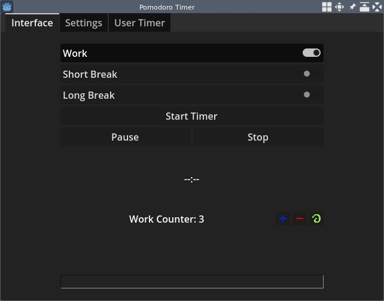
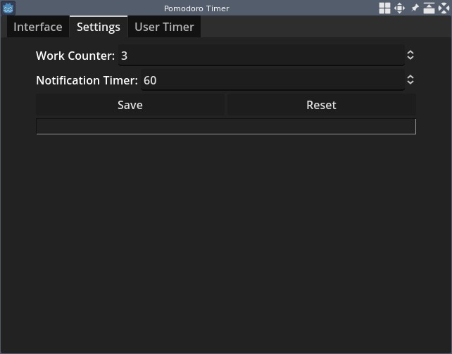
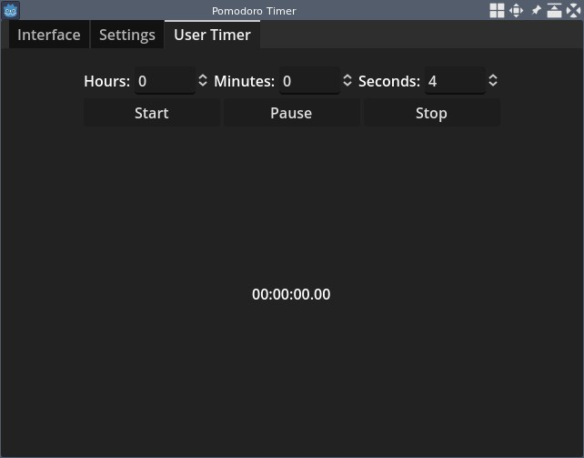

# Pomodoro Timer
A simple and easy to user pomodoro timer.

## Installation
Simply download one of the [releases](/releases). It is possible to export this project yourself using your own build of Godot.

**Note:** This project was built and tested on Godot version 4.3 stable.

## Usage
The interface is very simple to use!

The first tab (labelled "Interface") contains the main functionality. You can choose between work mode, short break mode, and long break mode. They set the timers to 25, 5, and 15 minutes respectively. You can pause the timer and stop it.

When the timer is active, a label shows the current position of the timer. When it hits zero, an alarm plays and the label resets. Additionally, a system notification is displayed, indicating to the user that their timer has stopped.

The work counter is used to control what modes to switch between when the timer goes off. Here is how it works:

1. When the work mode timer hits zero, the work counter decreases by one, and the timer switches to short break mode.
2. When the short break mode timer hits zero, it switches back to work mode.
3. Steps 1 and 2 are repeated until the work counter hits zero, at which point the timer switches to long break mode.
4. When the long break mode timer hits zero, it switches back to work mode, and the work counter resets to its default value.
5. The cycle repeats.

In this tab, you can control various settings, such as the work counter and the notification duration. The buttons work as you'd expect.

In this tab, you can set a timer for a custom duration---this is simply a countdown timer. The alarm that plays for this is different from the one on the "Interface" tab, so you can differentiate between the two. The timer duration is remembered by the application.
